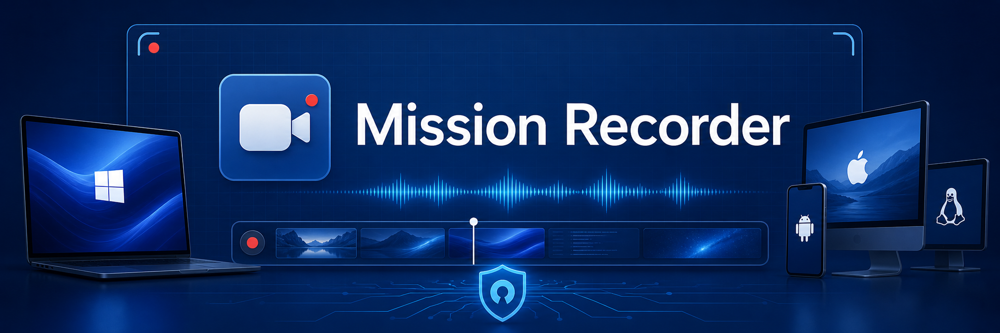

# Mission Recorder



**Mission Recorder** — Kotlin-утилита для захвата экрана, звука и важных моментов на Windows, macOS, Linux (Ubuntu) и Android. Проект объединяет CLI для быстрых сценариев и Compose Multiplatform GUI для повседневной работы.

Главный фокус: простота, удобство, функциональность, безопасность, открытость и полностью бесплатное использование.

> Статус: проект в разработке. Этот README описывает целевое видение продукта и ключевые направления реализации.

## Возможности

- Запись всего экрана или выбранного монитора.
- Запись выделенной области экрана.
- Захват конкретного приложения без лишнего содержимого вокруг.
- Запись микрофона и системного звука.
- Фильтрация системного звука по приложениям.
- Фоновая запись с сохранением последних `N` минут по кнопке или горячей клавише.
- Экспорт записи в изображение с кадрами по настраиваемой частоте кадрирования.
- CLI-режим для автоматизации и GUI-режим для удобного управления.

## Почему Mission Recorder

Mission Recorder создается для ситуаций, где запись должна быть быстрой, понятной и подконтрольной пользователю. Инструмент не требует сложной настройки, не прячет базовые возможности за платными уровнями и не делает облако обязательной частью рабочего процесса.

Проект ориентирован на локальную работу: пользователь контролирует, что записывается, где хранится и как экспортируется. Открытая Kotlin-архитектура упрощает аудит, расширение и адаптацию под разные платформы.

## Для кого

- Разработчики, которым нужно быстро записывать баги, демо и воспроизведения проблем.
- Пользователи, которым нужен простой экранный рекордер без подписок.
- Команды, которым важны прозрачность, локальное хранение и кроссплатформенность.
- Создатели гайдов, видеоинструкций и технических материалов.

## Технологии

- Kotlin
- Gradle
- CLI
- Compose Multiplatform
- Kotlin Coroutines и Flow
- JNI и Kotlin/Native interop для платформенного захвата

## Разработка

Используйте Gradle Wrapper из корня репозитория:

```bash
./gradlew run
./gradlew build
./gradlew check
```

На Windows:

```powershell
.\gradlew.bat run
.\gradlew.bat check
```

## Принципы продукта

- **Просто**: быстрый старт без перегруженного интерфейса.
- **Безопасно**: локальная обработка и явное управление разрешениями.
- **Открыто**: код и архитектура доступны для проверки.
- **Функционально**: запись экрана, приложений, областей, микрофона и системного звука.
- **Бесплатно**: базовая ценность продукта не должна зависеть от подписки.
